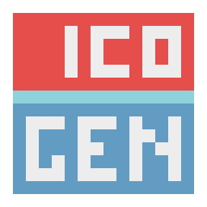
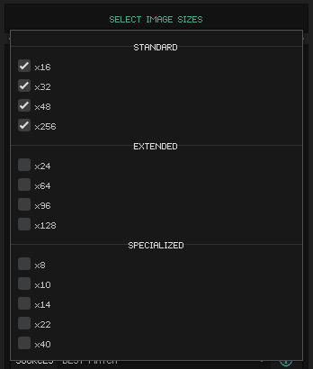
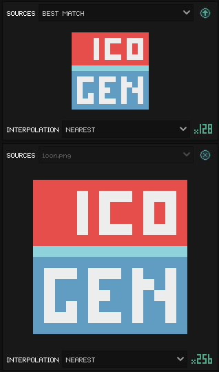
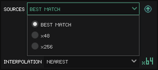
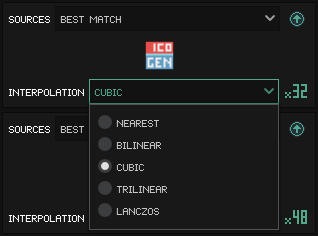
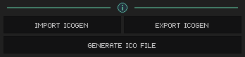

# ICOGen
 
### by Digital Faction

A lightweight GUI based .ico file creator that supports mixed icon sizes, and provides fine-grained control over source images and automatic image resizing.

### [Releases available on itch.io](https://dfaction.itch.io/icogen)

## How to Use

### Select image-sizes to embed

The standard sizes Windows expects (and recommends) for inclusion in a desktop icon are already selected by default. If you intend to use the icon with Godot, you should also select `x64` and `x128` under `Extended` sizes.

For a breakdown of what each image-size is intended for, see [this relevant Microsoft design document](https://docs.microsoft.com/en-us/windows/win32/uxguide/vis-icons?redirectedfrom=MSDN#size_requirements)

### Select source-images

Source-images can be loaded by clicking the load (up-arrow) button for an image-size. A source-image of any size can be used on any output image-size, although it's best to choose the closest in size or a size that's a multiple of the source, to reduce quality-loss due to resizing.

If a source-image is no longer required, it can be removed by clicking the remove `(X)` button for an output image-size.

Source-images do not need to be resized variants of each-other. In fact, it's often recommended that different designs be used for various icon sizes, to improve readability. Some programs have been known to hide easter-eggs by hiding different images in uncommon icon sizes.

For image-sizes that don't have a source-image, ICOGen will attempt to find a best-match and use that. This can be overridden by manually selecting a source-image from the `SOURCES` drop-down for that image-size. Image-sizes that have a source-image loaded cannot have their source-image overridden, instead it will display the source-image used.

### Select interpolation-mode

The interpolation-mode drop-down changes how the corresponding image-size will resize the source-image it uses. Play around with this setting to see which mode works best for your current situation. Different styles work better with different interpolation-modes.

As an example, the ICOGen icon is in a pixel-art style and resizes the clearest when using `NEAREST`, whereas `CUBIC` as shown in the image above, introduces noticeable blurriness.

### Export & Generate

Once you have an icon you're happy with, you can generate the corresponding `.ico` by pressing the `[GENERATE ICO FILE]` button. If you'd like to save your icon in an editable format you can load and edit again later, click the `[EXPORT ICOGEN]` button to generate a `.icogen` file that can be imported later to make additional changes. Load an existing `.icogen` file by clicking the `[IMPORT ICOGEN]` button.

#### .icogen files
When you export a `.icogen` file, it doesn't embed any source-images. When loaded, ICOGen will look for the source-images at their original location and in the same directory as the `.icogen` file if the image isn't found.

#### Additional info
If you'd like any additional info or licensing/copyright information, click the info `(i)` button.

## Eating Our Own Dogfood
ICOGen was developed for use in our own projects. The .ico for ICOGen was generated by ICOGen.

## Future Improvements
* Better error-handling. Currently errors are printed to the output log, but issues like missing images should show a warning in-program and potentially give the user an attempt to fix on-the-spot.
* Check for changes in source-images and auto-refresh them. Currently an image must be cleared and loaded again to show any changes made on disk.
* Support auto-updates, or at minimum the ability to check for updates and allow the user to visit the download page and manually update.
* Add theme support. Preferably support for native Godot themes due to the large pre-existing catalog of available themes.